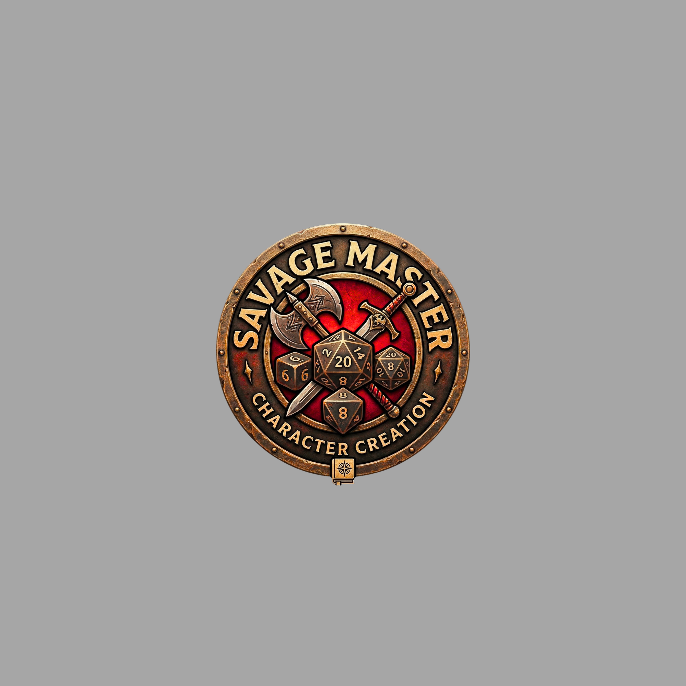

# Savage Master - Character Creator

A feature-rich **Savage Worlds** character creator built with vanilla JavaScript. Create characters for multiple campaign settings with a beautiful parchment-themed UI, complete with dice icons, setting banners, and full export support.



## Features

- **4 Campaign Settings** with unique content:
  - **Deadlands** - The Weird West
  - **Rifts** - The Tomorrow Legion
  - **Pirates** - 50 Fathoms
  - **Pathfinder** - Savage Pathfinder
- **9-Step Character Wizard**: Setting, Concept, Ancestry, Attributes, Skills, Hindrances, Edges, Gear, Review
- **Dice Icons**: SVG-based die shapes (d4, d6, d8, d10, d12) that visually represent each die type
- **Point-Buy System**: 5 attribute points, 15 skill points, up to 4 hindrance points
- **Derived Stats**: Auto-calculated Pace, Parry, Toughness, and Run Die
- **3 Export Formats**:
  - **Foundry VTT** (SWADE system) - ready to import
  - **Roll20** - character sheet format
  - **JSON** - universal data export
- **Setting-Specific Content**: Each setting adds unique races, edges, hindrances, and gear
- **Responsive Summary Panel**: Live character sheet preview while building

## Getting Started

1. Clone this repo
2. Open `index.html` in your browser, or serve it locally:
   ```bash
   python -m http.server 8765
   ```
3. Navigate to `http://localhost:8765`

No build tools, no dependencies - just pure HTML, CSS, and JavaScript.

## Tech Stack

- **Vanilla JavaScript** - zero frameworks, zero dependencies
- **CSS Custom Properties** - full theming support
- **Google Fonts** - Cinzel (headings) + Crimson Text (body)
- **SVG Dice Icons** - inline SVGs for d4, d6, d8, d10, d12
- **Canva** - setting banners and background assets

## Project Structure

```
index.html       - Main HTML shell
style.css        - Parchment theme styles
app.js           - Application logic & UI rendering
data.js          - Core SWADE data (attributes, skills, edges, hindrances, gear)
settings.js      - Campaign setting definitions (Deadlands, Rifts, Pirates, Pathfinder)
logo.png         - Savage Master logo
bg-parchment.jpg - Background texture
banner-*.jpg     - Setting banner images
```

## Created By

**Visionary Studios 101** - *"WarriorKing"*

## License

This is a fan-made tool for the Savage Worlds RPG system. Savage Worlds and all related content are trademarks of Pinnacle Entertainment Group.
